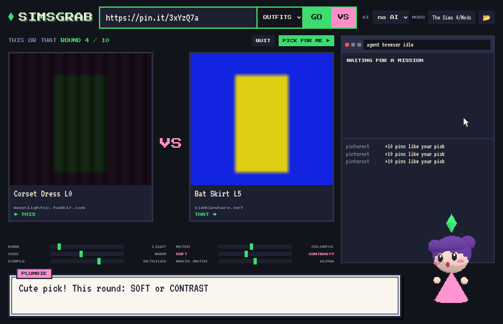
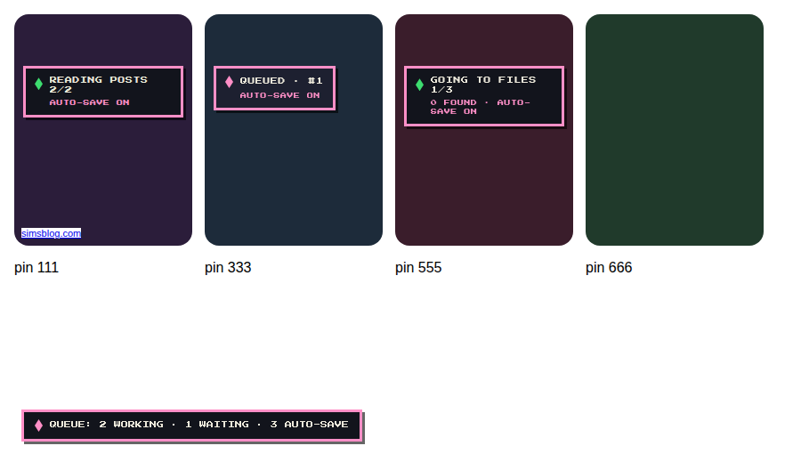
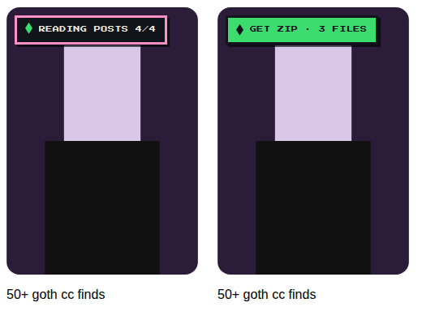

# SimsGrab

Say one word, like **goth**, pick a category, like **OUTFITS**, and get the top 50 mods in one click, installed straight into your Sims 4 `Mods` folder. Or paste a Pinterest pin and get it plus up to 49 mods like it, the same way.

**Plumbie**, a bubbly little 3D assistant, walks you through it with Pokémon-style dialog boxes. She also notices when you have loose mods in Downloads and offers to move them.




## What you see

- **The one line:** a word, a category, and **GO**. Or paste a Pinterest link:
  - **Pin:** the pin itself (marked **THIS PIN**), Pinterest's related pins, the rest of its board, then a web search on its description, up to 50. Download all, just the pin, or pick.
  - **Board** (`pinterest.com/user/board/`): every pin on it. **Profile:** their latest pins.
- **This or That (VS):** start from a pin or a word and hit **VS**. Each round shows two mods that look alike except for one quality. Pick with a click or ← →. Your taste is the average of your picks, and each next pair is chosen from it. Picking a pin pulls in more pins like it. After 10 rounds, or **PICK FOR ME**, every mod is ranked by **% MATCH** and your top 20 are ready to download.
  - **With a model picked in AI**, the model does the choosing. Each round it gets your picks and passes, plus a shortlist of candidates described by their qualities. It picks one mod you'll likely love and one that tests what it's unsure of, and Plumbie reads out its reason. At the end it picks your top 20 from the best 40, in its own order, and names your taste. Its picks get a ★. Without a model, or if its answer doesn't make sense, the averaging math decides.
  - Qualities come from each mod's picture: DARK–LIGHT, MUTED–COLORFUL, COOL–WARM, SOFT–CONTRASTY, SIMPLE–DETAILED. MAXIS MATCH–ALPHA comes from the title. The meter under the pair shows where your taste sits.
- **Result grid:** up to 50 pages with preview images. Click cards to pick or unpick, then **DOWNLOAD PACK**. Each card shows `...` while working, `✓ IN` when installed, `✗` when it failed.
- **Agent browser:** the page an agent is reading right now and the link it clicks (green bar with the cursor). The log underneath lists every step.
- **Plumbie:** click her any time for the menu. Use the arrow keys and Enter, or the mouse.
- **AI:** pick any model from your local [Ollama](https://ollama.com). It's free, open source and runs on your PC. It writes the searches and reads each page's links to choose what to click. Pick **no AI** to use the built-in rules only.
- **MODS:** click the path to change it. Defaults to `Documents\Electronic Arts\The Sims 4\Mods`.

Mods are installed to `Mods\SimsGrab\<pack or mod name>\`. `.ts4script` files go one level up, where the game can load them. Each pack is also zipped to `Downloads\SimsGrab\<pack>.zip`.

## Chrome extension

**Works right on Pinterest.** Every pin gets a pixel **◆ GRAB MODS** button. It shows when you hover the pin, just below Pinterest's own Save row. A pin's own page gets a big **SIMSGRAB** button in the bottom-left corner.

- **Click it and walk away.** The pin joins a queue and saves itself when it's done (**AUTO-SAVE ON**). Click as many pins as you like. Two are worked on at a time, and clicked pins go ahead of ones you only hovered. A counter in the corner shows what's working, waiting and auto-saving.
- **Straight into Mods.** With the SimsGrab app open, finished packs go right into `Mods\SimsGrab\<pack name>\`, zips inside zips included, and Plumbie tells you. With the app closed, the zip lands in `Downloads` and the app offers to move it when you open it.

What it does for each pin:

1. **SCANNING**: it finds the page the pin was saved from, using the source link Pinterest shows on the pin if there is one. If that page is a list of CC posts (the "50+ goth CC finds" kind), it reads each post too.
2. **GOING TO FILES 3/8 · 2 FOUND**: it follows every download link (SimFileShare, MediaFire, Drive, Dropbox, Patreon, ModTheSims, direct files, links behind Tumblr redirects) to the real file. Each file is checked by its file signature, so images, ads and login pages are left out.
3. **It doesn't give up easily:**
   - Network errors, rate limits and server hiccups are retried.
   - "Your download starts in 10 seconds" pages are waited out.
   - **AGENT WAITING ON …**: when a page only shows its file after JavaScript, a countdown or a button press, a browser agent opens it in a minimized window. It waits up to 40 seconds and presses **Download** like a person would, then catches the file. Its windows and pop-ups are closed afterwards.
   - Anything it catches that isn't a mod is deleted.
4. **IN MODS! · 5 FILES**, or **GET ZIP** if you only hovered: click it to save the zip.

If nothing can be fetched (logins, paid posts, a pin with no link), the button says so. Click it to open the source page.





On any other page, click the plumbob in the toolbar. It lists every mod link on the page with **GET** and **GRAB ALL** buttons.

It runs in your own Chrome, so your logins work: Patreon posts you have access to, Tumblr, and sites that block bots. If the SimsGrab app is running, Plumbie offers to move new downloads into Mods.

**Install:** unzip `SimsGrab-chrome.zip` from the latest release, open `chrome://extensions`, turn on **Developer mode**, click **Load unpacked** and pick the unzipped folder. Then pin it with the puzzle icon.

## How it works

1. **Search:** DuckDuckGo (Bing as fallback) is searched with ~9 query variations until there are 50 unique pages. Pinterest boards, YouTube, Reddit and social sites are skipped.
2. **Pinterest agent:** reads pins through Pinterest's public widget API (pin info, board pins) and its related-pins feed, and keeps the pins that link to an outside page.
3. **Site agents** follow the trail: Tumblr, SimFileShare, MediaFire, Google Drive, Dropbox, Patreon (public posts), ModTheSims, and direct `.zip` / `.rar` / `.7z` / `.package` / `.ts4script` links. Four run at once.
4. The first real mod file on each trail (checked by its file signature, not its name) is saved and installed. Agents retry network errors, rate limits and server hiccups, and wait out "download starts in N seconds" pages.
5. **Chrome door:** while the app is open, it listens on `127.0.0.1:47323` for packs from the Chrome extension and unpacks them into Mods. Only the extension gets in: web pages can't send a `chrome-extension://` origin or the custom header the door requires.
6. **Downloads watcher:** every 20 s it looks for `.package`, `.ts4script` and zips containing them in `Downloads`. **Tidy** moves them into Mods; zips are unpacked and then kept in `Downloads\SimsGrab`.

Sites behind logins, captchas or ad gates (The Sims Resource, CurseForge, paid Patreon posts) fail, and so do list articles where the mods sit on other pages. `.rar` / `.7z` downloads are saved but have to be unpacked by hand.

## Get it

**Windows:** download `SimsGrab.exe` from the latest release, or from the newest *SimsGrab exe* run under Actions. It uses Edge WebView2, which comes with Windows 10 and 11. For AI, install Ollama and pull a model, for example `ollama pull llama3.2`.

**From source (Python 3.9+):**

```
pip install pywebview
python simsgrab.py                      # window
python simsgrab.py https://pin.it/xxxx  # command line, no window
```

## Build the exe yourself

```
pip install pyinstaller pywebview
pyinstaller --onefile --windowed --name SimsGrab --add-data "web;web" simsgrab.py
```

Pushing a tag named `simsgrab-v*` builds the exe and attaches it to a GitHub release.

## Credits

[three.js](https://threejs.org) (MIT). Pixel fonts [Press Start 2P](https://fonts.google.com/specimen/Press+Start+2P) and [VT323](https://fonts.google.com/specimen/VT323), SIL Open Font License (see `web/`).
