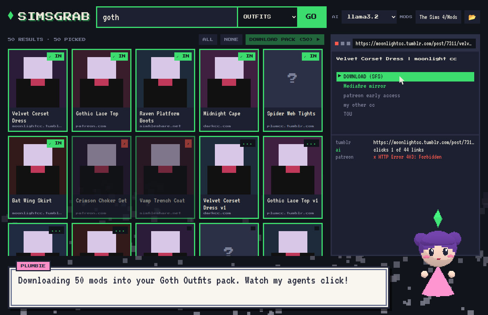

# SimsGrab

Say one word, like **goth**, pick a category, like **OUTFITS**, and get the top 50 mods in one click, installed straight into your Sims 4 `Mods` folder. Or paste a Pinterest pin and get it plus up to 49 mods like it, the same way.

**Plumbie**, a bubbly little 3D assistant, walks you through it with Pokémon-style dialog boxes. She also notices when you have loose mods in Downloads and offers to move them.



## What you see

- **The one line:** a word, a category, and **GO**. Or paste a Pinterest link:
  - **Pin:** the pin itself (marked **THIS PIN**), Pinterest's related pins, the rest of its board, then a web search on its description, up to 50. Download all, just the pin, or pick.
  - **Board** (`pinterest.com/user/board/`): every pin on it. **Profile:** their latest pins.
- **Result grid:** up to 50 pages with preview images. Click cards to pick or unpick, then **DOWNLOAD PACK**. Each card shows `...` while working, `✓ IN` when installed, `✗` when it failed.
- **Agent browser:** the page an agent is reading right now and the link it clicks (green bar with the cursor). The log underneath lists every step.
- **Plumbie:** click her any time for the menu. Use the arrow keys and Enter, or the mouse.
- **AI:** pick any model from your local [Ollama](https://ollama.com). It's free, open source and runs on your PC. It writes the searches and reads each page's links to choose what to click. Pick **no AI** to use the built-in rules only.
- **MODS:** click the path to change it. Defaults to `Documents\Electronic Arts\The Sims 4\Mods`.

Mods are installed to `Mods\SimsGrab\<pack or mod name>\`. `.ts4script` files go one level up, where the game can load them. Each pack is also zipped to `Downloads\SimsGrab\<pack>.zip`.

## How it works

1. **Search:** DuckDuckGo (Bing as fallback) is searched with ~9 query variations until there are 50 unique pages. Pinterest boards, YouTube, Reddit and social sites are skipped.
2. **Pinterest agent:** reads pins through Pinterest's public widget API (pin info, board pins) and its related-pins feed, and keeps the pins that link to an outside page.
3. **Site agents** follow the trail: Tumblr, SimFileShare, MediaFire, Google Drive, Dropbox, Patreon (public posts), ModTheSims, and direct `.zip` / `.rar` / `.7z` / `.package` / `.ts4script` links. Four run at once.
4. The first real mod file on each trail (checked by its file signature, not its name) is saved and installed.
5. **Downloads watcher:** every 20 s it looks for `.package`, `.ts4script` and zips containing them in `Downloads`. **Tidy** moves them into Mods; zips are unpacked and then kept in `Downloads\SimsGrab`.

Sites behind logins, captchas or ad gates (The Sims Resource, CurseForge, paid Patreon posts) fail, and so do list articles where the mods sit on other pages. `.rar` / `.7z` downloads are saved but have to be unpacked by hand.

## Get it

**Windows:** download `SimsGrab.exe` from the latest release, or from the newest *SimsGrab exe* run under Actions. It uses Edge WebView2, which comes with Windows 10 and 11. For AI, install Ollama and pull a model, for example `ollama pull llama3.2`.

**From source (Python 3.9+):**

```
pip install pywebview
python simsgrab.py                      # window
python simsgrab.py https://pin.it/xxxx  # command line, no window
```

## Build the exe yourself

```
pip install pyinstaller pywebview
pyinstaller --onefile --windowed --name SimsGrab --add-data "web;web" simsgrab.py
```

Pushing a tag named `simsgrab-v*` builds the exe and attaches it to a GitHub release.

## Credits

[three.js](https://threejs.org) (MIT). Pixel fonts [Press Start 2P](https://fonts.google.com/specimen/Press+Start+2P) and [VT323](https://fonts.google.com/specimen/VT323), SIL Open Font License (see `web/`).
